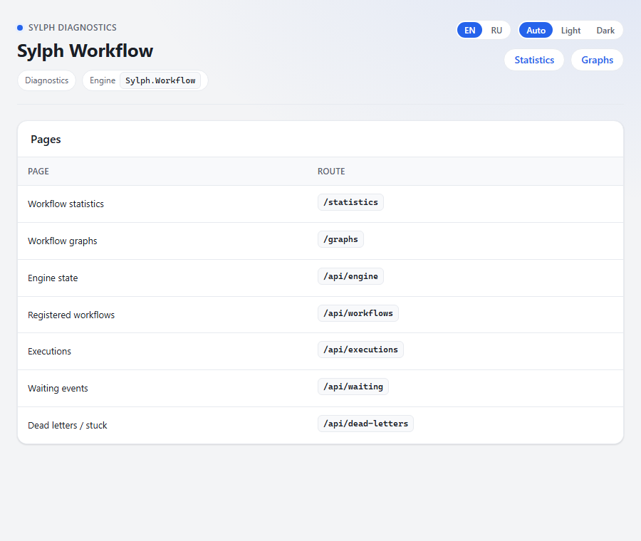
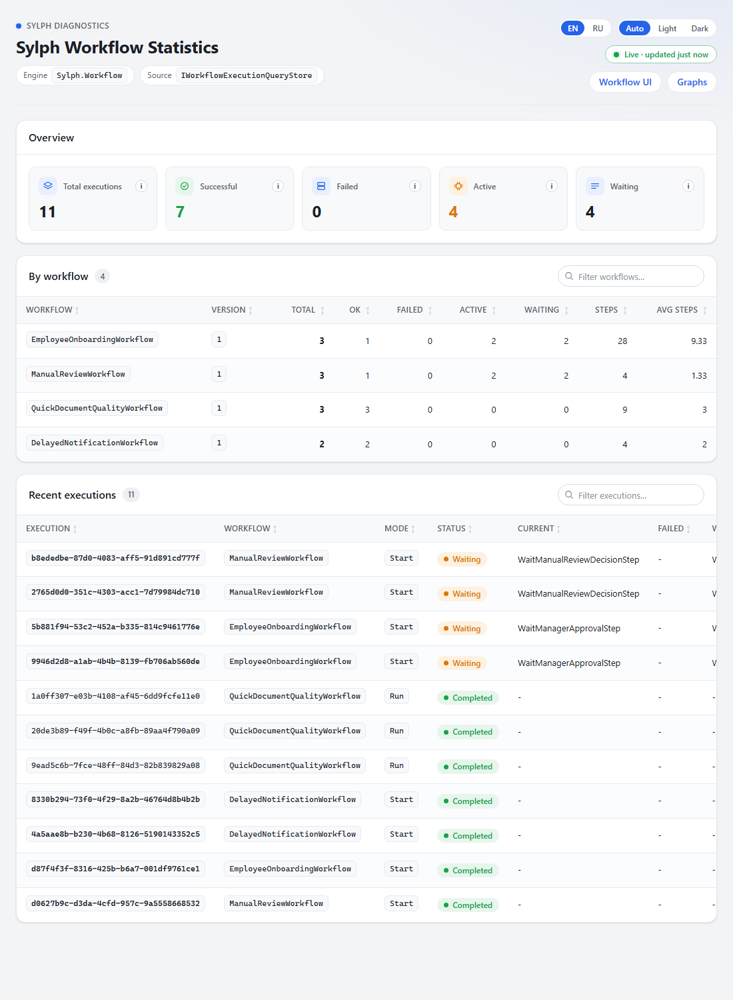
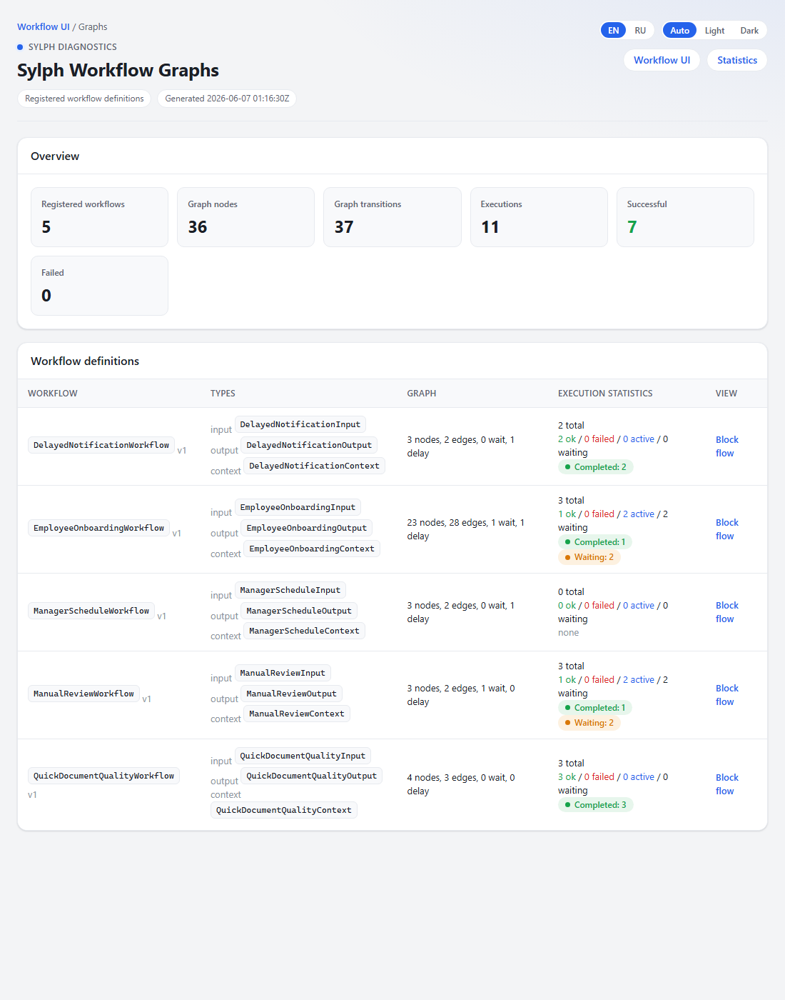
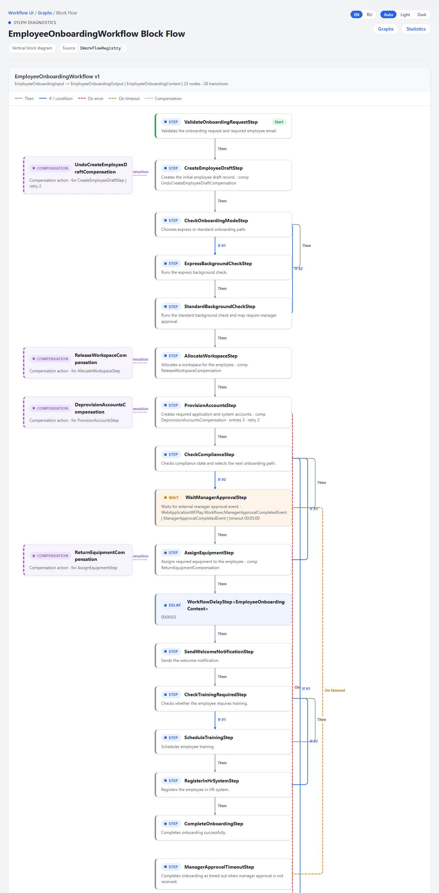
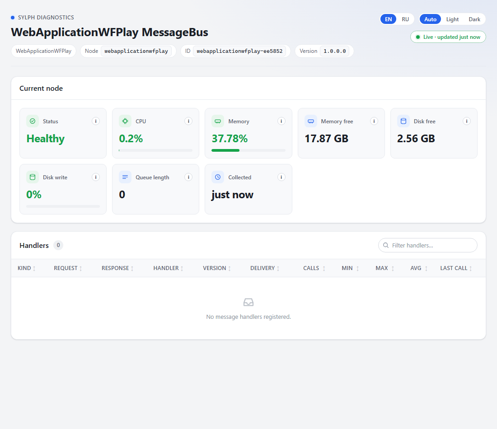

# Диагностический UI

Sylph включает встроенные диагностические страницы — это серверно-рендеримый HTML
(без сборки фронтенда), который монтируется одной строкой в `Program.cs`. Поддерживаются
светлая/тёмная темы (Auto/Light/Dark) и переключение языка (EN/RU).

> Скриншоты ниже сняты на песочнице `WebApplicationWFPlay` (`http://localhost:5079`)
> после запуска нескольких демо-воркфлоу.

## Монтирование

```csharp
// Шина и балансировщик (Sylph.UI)
app.MapMessageBusStatisticPage("/message-bus");
app.MapBalancerStatisticPage("/balancer");

// Шлюз (Sylph.UI)
app.MapGatewayStatisticPage("/");

// Воркфлоу (Sylph.Workflow.UI) — требует AddSylphWorkflowUi()
app.MapSylphWorkflowUi("/workflow");
```

---

## Страницы воркфлоу

### Лендинг

`MapSylphWorkflowUi("/")` — точка входа со ссылками на статистику, графы и JSON-API.



### Статистика исполнений

`/{base}/statistics` — сводка (всего / успешные / ошибки / активные / ожидающие),
разбивка по воркфлоу и таблица последних исполнений со статус-пилюлями. Обновляется
поллингом каждые ~5 секунд (индикатор «Live»).



### Граф определений

`/{base}/graphs` — обзор всех зарегистрированных воркфлоу: число узлов/переходов,
типы input/output/context и агрегированная статистика исполнений.



### Block-flow конкретного воркфлоу

`/{base}/graphs/flow?id=workflow-N` — вертикальная блок-схема процесса: шаги, рёбра
с подписями (`Then`, `If`, `On error`, `On timeout`), карточки компенсаций слева,
выделение wait-event и delay-шагов. Наведение подсвечивает связанные узлы и рёбра.



Легенда рёбер:

| Стиль | Значение |
|---|---|
| сплошная серая | `Then` — переход по умолчанию |
| синяя | `If` — условный переход (`NextStepIf`) |
| красная пунктирная | `On error` — переход при ошибке (`OnError`) |
| оранжевая пунктирная | `On timeout` — таймаут wait-event |
| фиолетовая точечная | компенсация |

---

## Страница шины сообщений

`MapMessageBusStatisticPage(route)` — состояние текущего узла (статус, CPU, память,
свободная память/диск, длина очереди) и таблица обработчиков с их метриками
(тип запроса/ответа, версия, режим доставки, число вызовов, min/max/avg длительности).



> На скриншоте список обработчиков пуст — песочница `WebApplicationWFPlay` не
> регистрирует прикладных `IRequestHandler`. В демо-сервисах (`SylphDemo.*`) таблица
> заполнена реальными обработчиками и их статистикой.

## Страница балансировщика

`MapBalancerStatisticPage(route)` — список узлов кластера и их метрики, по которым
`WeightedMicroserviceNodeSelector` выбирает целевой узел. Связана со страницей шины
навигацией. Наиболее наглядна при запуске нескольких узлов (например, `products-1` и
`products-2` в [Aspire](getting-started.md#вариант-б--весь-стек-через-aspire)).

## Темы и язык

Переключатели в шапке любой страницы: **EN/RU** и **Auto/Light/Dark**. Выбор
сохраняется в `localStorage` и применяется до отрисовки (без «мигания»). В режиме
`Auto` тема следует системному `prefers-color-scheme`.

## Как пересоздать скриншоты

```bash
# 1) запустить песочницу
cd src/Samples/WebApplicationWFPlay
dotnet run --no-launch-profile        # http://localhost:5079

# 2) наполнить данными
curl -s http://localhost:5079/run_wf
curl -s "http://localhost:5079/start_onboarding_wf?express=false"
curl -s http://localhost:5079/start_review_wf

# 3) снять страницы (headless Chrome/Edge), например:
chrome --headless=new --hide-scrollbars --window-size=1280,2600 \
  --screenshot=docs/images/ui-workflow-blockflow.png \
  "http://localhost:5079/graphs/flow?id=workflow-1"
```

Страницы для съёмки: `/` (лендинг), `/statistics`, `/graphs`,
`/graphs/flow?id=workflow-N`, `/mb` (шина).
